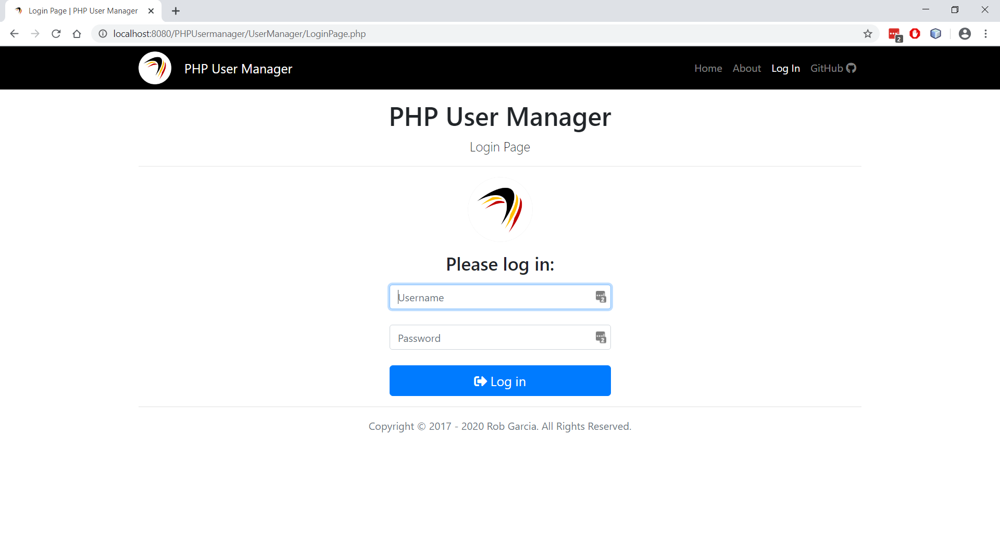

# PHP User Manager
The PHP User Manager recreates the functionality of .NET's Web Site Administration Tool (WSAT), allowing you to easily manage users, roles, and access. It is an extension of my tutorial, [Master Pages in PHP](https://github.com/garciart/Master-Pages-In-PHP "Master Pages in PHP"). Since it uses SQLite, you can simply download it and add it to your project, or you can clone it and use it as the foundation of your own web site.

---

---

## Steps:

To add it to your web site:

- Copy the UserManager folder and its contents into the root directory of your project.
- Open the Config.php file in the UserManager folder and edit the $ROOT_DIR and $APPLICATION_ROOT_DIR values so they match the folders of your project. You can also change the $ERROR_REPORTING value to "dev" for development.
- Add a link to LoginPage.php to your project.

And that's it. Make sure you check out [ROLES.md](https://github.com/garciart/PHPUserManager/blob/master/UserManager/ROLES.md "Role Levels in User Manager") to learn how to integrate roles levels into your application.

>***Please note that the focus of this repo is the code in the UserManager folder, which is meant to be copied, pasted, and integrated into a project through a link to the Login page. For that reason, this repo does not attempt to apply a Symfony, Laravel, or Codeigniter folder structure.***

## Background:

While my first programs were written in Basic and Assembly Language, the language I've used the most is C. To this day, if I have to write a quick utility program, I'll knock it out in C. So, it's not surprising that when I began to develop applications for the web, I started with C# and ASP.NET. All in all, I have written quite a few web sites using the lessons I learned from [Cristian Darie’s excellent book, Beginning ASP.NET 2.0 E-Commerce in C# 2005: From Novice to Professional](https://www.apress.com/us/book/9781590594681 "Beginning ASP.NET 2.0 E-Commerce in C# 2005").

However, while I love .NET, it has its limitations. For example, once you reach a certain point, .NET is not free, and neither are Microsoft's development or production tools (e.g., Visual Studio, SQL Server, etc.). Another issue is that many companies do not provide .NET hosting services. Hopefully, .NET Core, the cross-platform successor to .NET, will take off. In the meantime, to better serve my clients, I began to create alternative versions of my boilerplates in other languages, such as PHP and JavaScript. 

One of my boilerplates was a version of that beloved tool that many of us miss: The Web Site Administration Tool. Here it is for PHP, extending one of my previous tutorials, Master Pages in PHP. Feel free to copy it and use it if you need an authentication and user administration system. Have fun and good luck!

---

Thanks to Julen Pardo at [Web Code Geeks](https://www.webcodegeeks.com/php/login-form-php-example/ "Julen Pardo at Web Code Geeks") for the Key Derivation Functions (KDF).
